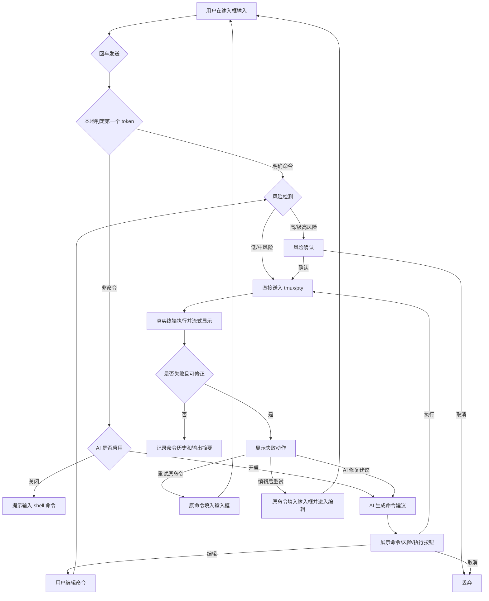
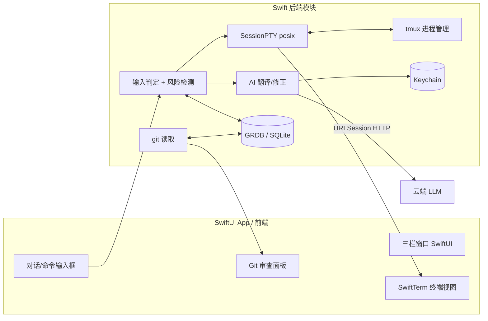

# Converse — 对话式终端 GUI 设计文档

> **状态**: ROUND 2.1 (原型交互细化) · 2026-07-01
> **定位**: 面向半专业用户的 macOS 本地终端，真实终端为底座，对话式命令层 + 文件夹会话组织 + Git 审查

---

## Version Change Log (Round 2.1 - 原型交互细化)

本轮基于可交互 HTML 原型的实际体验，细化输入辅助、终端模式、命令中断、会话生命周期与历史显示等交互决策：

1. **输入辅助三层化**：输入时优先弹出「历史命令建议浮层」（最接近的排第一，↑↓ 选择，回车/Tab 填入不执行）；无历史匹配时才走「命令补全」（命令名/子命令/参数/路径，Tab 补全）；空输入时 ↑↓ 切换历史。
2. **终端模式键盘直通**：原「焦点模式」改名为「终端模式」；vim 可直接编辑、shell 可输命令、REPL 可输入回车；按键实时回显并带光标。
3. **Ctrl+C 语义修正**：终端模式下 Ctrl+C 被 pty 接管，中断当前命令而非退出终端模式（vim 内无效）；对话模式下命令以流式执行（先显示「执行中」），期间 Ctrl+C 中断 → `^C` / 退出码 130。
4. **风险确认策略分档**：`risk.confirmation_policy` 新增 `standard`（中风险仅提示）/ `strict`（中风险也需确认）两档；极高风险倒计时确认时焦点落到「取消」按钮，默认不聚焦执行按钮。
5. **会话生命周期精简**：移除 `detached` 分离状态及分离/切换菜单项（切换会话本身即 detach 语义）；关闭会话直接从列表移除（kill tmux，不再保留 closed 灰条）。
6. **历史显示策略区分**：新执行命令完整实时显示（由 tmux scrollback 决定行数）；历史/恢复的旧输出显示头 200 + 尾 200 行，中间以省略号表示。
7. **左栏移除历史 Tab**：历史仅在 ⌘K 命令面板、↑↓ 历史、输入建议浮层中触达；输出摘要限制暂不可改（固定 8KB/200 行）。
8. **片段（Snippets）可新建**：左栏片段区「+」新建（触发词 + 命令）；AI 建议卡片可「存为片段」；输入触发词即执行对应命令。
9. **⌘K / ⌘R 导航**：⌘K 搜索结果选中会话可跨文件夹自动跳转；⌘R 直接打开命令面板并定位到历史 Tab。
10. **工作区右键菜单**：New Session / Edit（重命名工作区）/ Reveal in Finder / Close（移除侧栏，不删磁盘目录和会话）。
11. **首次启动 Onboarding**：4 步欢迎向导（功能介绍 → AI 配置选择 → 文件夹选择 → 就绪），localStorage 记忆。
12. **报错辅助模式具体化**：命令失败（command not found / 权限错误）自动弹出 AI 修复气泡（拼写纠错 / brew install / 追加排除路径），区别于建议模式的三动作菜单。

---

## Version Change Log (Round 2)

本轮基于 v1 讨论结果收敛 MVP 边界，重点修正输入判定、终端显示、会话恢复和数据模型：

1. **AI 功能改为用户可配置**：支持关闭 AI、AI 建议模式、AI 报错辅助模式；AI 不再被视为产品必需能力。
2. **重写输入判定策略**：明确命令直接执行；非命令走 AI；命令执行失败且出现 `command not found` / 语法错误 / 参数错误时，提供 AI 修正建议，仍需用户确认。
3. **明确终端显示架构**：底层始终是真实终端（终端 emulator + pty + tmux），对话气泡只承载用户输入、AI 建议、命令记录和可折叠输出摘要；不把所有终端行为硬塞进聊天气泡。（v2.1：emulator 选型由 xterm.js 改为 SwiftTerm，见 5.1）
4. **引入终端焦点模式**：`vim`、`top`、`less`、Python/Node REPL 等交互式程序接管中间区域，底部对话输入框临时禁用。
5. **默认使用 tmux 恢复会话**：每个 Converse 会话绑定独立 tmux 会话或 pane；App 退出不杀 tmux；用户明确关闭 session 才 kill。
6. **Git 面板保持只读**：commit/push 等动作通过用户命令或 AI 命令完成，右侧 Git 面板只负责展示改动。
7. **危险命令改为风险分级**：不只做黑名单，按文件删除、权限修改、网络脚本执行、磁盘操作、Git destructive 操作等分类触发确认。
8. **扩展数据模型**：区分 Folder、Session、CommandRun、AiSuggestion、GitSnapshot；终端完整输出不永久落库，只保存可搜索、可审计、可恢复 UI 状态的摘要信息。
9. **简化命令历史面板**：历史面板只负责把选中命令填入输入框，不提供直接执行、查看输出等额外动作。
10. **收敛失败命令处理**：失败后只保留重试原命令、编辑后重试、AI 修复建议；不提供回滚建议。
11. **移除本地模型依赖**：AI 统一走可配置云端 API（默认 DeepSeek）；few-shot 示例检索使用纯文本关键词/TF-IDF 匹配，不依赖 embedding、本地模型或向量数据库。
12. **跳过专项可访问性**：MVP 不做 VoiceOver、高对比度、减少动效等专项适配。

---

## 一、产品概述

### 1.1 一句话定义

Converse 是一个把终端变得更像对话的 macOS 应用：你可以直接输入命令，也可以用自然语言让 AI 生成命令；所有终端会话按文件夹组织，退出后可恢复，旁边还能看 Git 改动。

### 1.2 核心定位

Converse 不是把终端伪装成聊天软件，而是在真实终端之上增加三层能力：

1. **对话式命令层**：自然语言生成 shell 命令，用户确认后执行。
2. **会话组织层**：按真实文件夹组织多个长期存在的终端会话。
3. **上下文审查层**：右侧展示当前项目的 Git 改动，帮助用户理解命令影响。

### 1.3 要解决的三个痛点

| 痛点       | 现状                                 | Converse 的解法                                                        |
| ---------- | ------------------------------------ | ---------------------------------------------------------------------- |
| 命令记不住 | 半专业用户查文档、复制粘贴、经常打错 | 用户说"列出大文件"，AI 生成可执行命令，用户确认后执行                  |
| 会话乱     | tab 满天飞，不知道哪个窗口在干哪件事 | 文件夹 -> 会话：每个终端会话属于一个项目文件夹，有名字、有状态、可恢复 |
| Git 看不懂 | 命令行 git diff 难读，要切到别的工具 | 右栏 Git 审查：实时 diff、改动文件树、当前分支                         |

### 1.4 不做什么（MVP 边界）

- 不做 SSH 远程连接（MVP 只本地）
- 不做云端同步/账号体系
- 不做插件/扩展市场
- 不做编辑器（不替代 VS Code）
- 不做全自动 Agent（AI 生成的命令必须展示给用户确认）
- 不做 Git 图形操作按钮（Git 面板只读，commit/push 通过命令完成）
- 不做本地模型/Ollama 依赖（MVP 统一走云端 API，默认 DeepSeek）
- 不做专项可访问性适配（VoiceOver、高对比度、减少动效暂不进入 MVP）

### 1.5 产品哲学

- **真实终端是底座**：Converse 必须先是一个可用的本地终端，支持真实 shell、pty、ANSI、交互式程序和长期会话。
- **对话是增强层**：自然语言输入、AI 命令建议、报错修正是增强能力，不替代终端本身。
- **透明优先**：AI 生成的真实命令必须展示出来，用户确认后才执行。
- **用户命令零摩擦**：用户明确输入的 shell 命令直接执行，不经过 AI，也不默认要求确认。
- **危险动作显式保护**：高风险命令即使来自用户直接输入，也可以触发非阻塞提示或强确认。
- **会话即任务**：每个终端会话有归属文件夹、名字、tmux 状态和历史记录，不是匿名 tab。

---

## 二、用户画像

### 2.1 主力用户：半专业用户

**画像**：

- 职业：设计师、产品经理、数据分析师、学生、独立开发者、Maker/家庭服务器玩家
- 特征：会用终端但用不顺；能跑 `npm install`、`git commit`，但记不住 `awk`、`sed`、`find` 的参数
- 频率：每周用几次，不是每天 8 小时
- 痛点：命令记不住、tab 管理乱、Git diff 看不懂

### 2.2 次要用户：专业开发者

- 他们可能为了"自然语言快速生成命令"、"长期会话恢复"或"文件夹会话组织"而来
- 但他们是锦上添花用户，不是 MVP 主力

### 2.3 非目标用户

- 完全不用电脑命令行的人
- 每天 8 小时在终端里的高级 SRE，且已经深度依赖自定义 tmux/zsh 工作流的人

### 2.4 典型场景

**场景 A：设计师跑构建脚本**

> 小林是设计师，偶尔要跑前端项目。她打开 Converse，在"公司官网"文件夹下新建会话，输入"把依赖重装一下"。Converse 生成 `rm -rf node_modules && npm install`，标记为高风险删除动作并要求确认。她确认后命令执行，输出实时显示。

**场景 B：学生管理多个作业**

> 小王在学编程，同时做 3 门课作业。他在左栏建了"数据库课""算法课""Web课"三个文件夹，每个下面开着各自的终端会话。App 退出后 tmux 会话继续存在，下次打开自动恢复。

**场景 C：产品经理看 Git**

> 赵姐改了 README，想提交。她在 Converse 里说"看看我改了啥"，右栏 Git 面板展示改动文件和 diff。她说"提交并写说明：更新 README"，Converse 生成 `git add README.md && git commit -m "更新 README"`，她确认后执行。Git 面板本身不提供 commit 按钮。

---

## 三、功能详解

### 3.1 功能清单（MVP）

| 编号 | 功能                 | 优先级 | 说明                                                                    |
| ---- | -------------------- | ------ | ----------------------------------------------------------------------- |
| F1   | 本地终端执行         | P0     | 基于 pty 跑真实 shell，底层接入 tmux                                    |
| F2   | 文件夹 -> 会话组织   | P0     | 左栏项目和会话管理                                                      |
| F3   | 会话恢复             | P0     | App 退出不杀 tmux，重启后恢复会话                                       |
| F4   | 命令输入判定         | P0     | 明确命令直接执行，非命令走 AI，失败后可 AI 修正                         |
| F5   | AI 命令翻译          | P0     | 自然语言转 shell 命令，用户确认后执行                                   |
| F6   | AI 开关与模式        | P0     | 关闭 AI / AI 建议 / AI 报错辅助                                         |
| F7   | 命令确认机制         | P0     | AI 生成命令必须确认；危险命令按风险分级处理                             |
| F8   | 真实终端显示模式     | P0     | 普通输出可折叠；TUI/REPL 进入终端焦点模式                               |
| F9   | Git 审查面板（只读） | P1     | 右栏显示 diff、改动文件树、当前分支                                     |
| F10  | 历史与输出摘要       | P1     | 历史经 ⌘K / ↑↓ / 输入建议浮层触达（无独立面板）；选中只填入输入框；按会话保存命令记录、exit code、输出摘要 |
| F11  | 上下文感知           | P1     | AI 知道当前目录、会话名、最近输出摘要                                   |
| F12  | 快捷键`⌘K`        | P2     | 全局搜索/跳转                                                           |

### 3.2 AI 功能模式

AI 是可选能力，用户可以在设置中切换：

| 模式                | 行为                                               | 适用用户                               |
| ------------------- | -------------------------------------------------- | -------------------------------------- |
| 关闭 AI             | Converse 作为普通终端 + 会话管理 + Git 面板使用    | 不想配置 key、重视隐私、只需要会话管理 |
| AI 建议模式（默认） | 自然语言转命令，展示命令，用户确认后执行           | 主力用户                               |
| AI 报错辅助模式     | 不主动翻译自然语言，只在命令失败后询问是否帮忙修正 | 偏熟练用户                             |

无论 AI 是否启用，用户直接输入命令的路径必须完整可用。

### 3.3 输入判定策略

#### 3.3.1 基本原则

- **明确命令直接执行**：例如 `ls -la`、`git status`、`npm run build`、`./script.sh`。
- **明确自然语言走 AI**：例如"列出大文件"、"帮我重装依赖"、"看看我改了什么"。
- **失败命令可回退 AI**：如果执行结果是 `command not found`、shell 语法错误或明显参数错误，显示"要让 AI 帮你改写吗？"
- **AI 改写仍需确认**：失败后的 AI 修正只生成建议，不自动执行。
- **混合输入谨慎处理**：例如 `git status 看一下`、`open 当前目录`、`cd 到桌面`，优先识别为需要 AI 的意图，或执行失败后提供 AI 修正。

#### 3.3.2 判定流程

1. 用户在底部输入框输入文本并按回车。
2. 本地解析第一个 token。
3. 若第一个 token 是 shell builtin、alias、函数、PATH 中可执行文件、相对路径或绝对路径：
   - 判定为命令，直接送入当前 tmux/pty。
   - 若风险等级为高或极高，触发对应确认。
4. 若第一个 token 不是命令：
   - AI 关闭：提示"这不像可执行命令，AI 未启用，可改为输入 shell 命令"。
   - AI 开启：进入自然语言翻译流程。
5. 命令执行失败后：
   - 若 exit code 或 stderr 表明 `command not found` / 语法错误 / 参数错误，显示 AI 修正入口。
   - 用户点击后，AI 生成修正命令，进入确认流程。

#### 3.3.3 示例

| 用户输入                 | 判定     | 处理                                           |
| ------------------------ | -------- | ---------------------------------------------- |
| `ls -la`               | 明确命令 | 直接执行                                       |
| `git status`           | 明确命令 | 直接执行                                       |
| `gti status`           | 失败命令 | shell 返回`command not found` 后提示 AI 修正 |
| `列出当前目录的大文件` | 自然语言 | AI 生成命令并等待确认                          |
| `open 当前目录`        | 混合输入 | 倾向 AI 建议，或执行失败后提供修正             |
| `git 看看状态`         | 混合输入 | 倾向 AI 建议，或执行失败后提供修正             |

### 3.4 AI 命令翻译与确认

自然语言输入流程：

1. 用户输入自然语言。
2. AI 基于当前 cwd、会话名、最近输出摘要生成 shell 命令。
3. UI 展示 AI 建议卡片：
   - 用户原话
   - 生成命令
   - 风险等级
   - `执行`、`编辑`、`取消`
4. 用户确认后，命令写入当前 tmux/pty。
5. 执行结果进入命令历史；可选生成简短解释。

关键约束：

- AI 不允许黑箱执行命令。
- AI 输出必须是可见命令文本，不能只给自然语言解释。
- 用户编辑过 AI 命令后，记录来源为 `ai_edited`。
- sudo 密码、密钥、token、环境变量中的敏感值不进入 AI 上下文。

### 3.5 命令失败后的处理

命令失败后只提供三个动作：

| 动作        | 行为                                                            |
| ----------- | --------------------------------------------------------------- |
| 重试原命令  | 将原命令重新填入输入框，用户再次按回车才执行                    |
| 编辑后重试  | 将原命令填入输入框并进入编辑状态，用户修改后按回车执行          |
| AI 修复建议 | AI 基于原命令、exit code 和输出摘要生成修复命令，用户确认后执行 |

MVP 不提供"回滚建议"。

原因：

- 大量 shell 操作不是事务型的，无法可靠回滚。
- `rm`、`git reset`、数据库迁移、权限修改、依赖安装等命令的副作用复杂。
- 错误的回滚建议会制造伪安全感。

后续版本如需提供恢复能力，也应命名为"可能的恢复方案"，并明确风险，而不是承诺回滚。

### 3.6 命令历史的触达（无独立面板）

> **v2.1 变更**：移除左栏独立的「历史面板」Tab。历史经三个入口触达，且任何入口选中都只填入输入框、不直接执行。

三个触达入口：

1. **输入建议浮层（最优先）**：输入时上方实时匹配本会话历史，↑↓ 选择，回车/Tab 填入（详见 §8.1）。
2. **⌘K 命令面板**：切到「历史」Tab 搜索，结果回车只填入输入框（⌘R 直达此 Tab）。
3. **↑↓ 历史导航**：输入框为空时按 ↑ 依次填入上一条命令。

交互规则（不变）：

- 任何入口选中历史命令 → 只填入输入框，**不直接执行**。
- 填入后需用户再次按回车才执行，避免误触。
- 不提供"直接执行"、"查看完整输出"、"收藏"等动作。

历史记录字段（SQLite，详见数据模型 CommandRun）：

- 命令文本、执行时间、exit code、来源（用户直接输入 / AI 建议 / AI 编辑 / 重试）、风险等级、输出摘要（脱敏、截断）。

### 3.7 本地终端执行与 tmux 会话

MVP 默认使用 tmux 作为会话保持层：

- 每个 Converse Session 绑定一个独立 tmux session、window 或 pane。
- Converse 后端通过 pty attach 到对应 tmux pane。
- App 退出时不杀 tmux。
- App 重启后扫描 Converse 管理的 tmux namespace 并恢复 UI。
- 只有用户明确点击"关闭会话"，才 kill 对应 tmux session/window/pane。
- 机器重启或 tmux server 异常退出后，只恢复会话元数据，shell 运行状态无法保证。

命名建议：

```text
converse_<session_id>
```

隔离原则：

- Converse 只管理自己命名空间下的 tmux 会话。
- 不扫描、不修改、不 kill 用户自己创建的 tmux 会话。
- 如果用户手动 kill 了 Converse 的 tmux 会话，UI 标记为 `missing`，允许重新创建。

### 3.8 文件夹 -> 会话组织

左栏结构：

```text
公司官网
  安装依赖 (running)
  跑构建
  调试样式
个人博客
  写新文章
数据库课
  作业3
```

- 文件夹 = 本地真实目录，绑定磁盘路径。
- 会话 = 该文件夹下的终端实例，有名字、有 tmux 状态、有历史记录。
- 新建文件夹时选择磁盘目录，或拖拽文件夹到左栏。
- 会话可重命名、可切换、可拖拽调整顺序。
- 删除文件夹只移除 Converse 中的记录，不删除磁盘目录。
- 如果删除文件夹时仍有运行中的会话，需要二次确认是否关闭这些会话。

MVP 不做"隐藏会话"概念，只保留：

- **切换会话**：会话继续存在。
- **退出 App**：tmux 会话继续存在，下次恢复。
- **关闭会话**：明确 kill tmux 会话，不再恢复。
- **删除文件夹**：移除组织记录，磁盘文件不受影响。

### 3.9 Git 审查面板（只读，P1）

右栏在当前会话所在文件夹是 Git 仓库时显示：

- 当前分支
- `git status --porcelain` 改动文件树
- 选中文件 diff
- staged / unstaged 状态

MVP 只读，不提供 commit、push、checkout、reset 等按钮。

Git 操作通过命令完成：

- 用户直接输入：`git status`、`git add README.md`、`git commit -m "..."`
- 自然语言生成：用户说"提交 README，说明是更新文档"，AI 生成命令，用户确认后执行

这样可以避免右侧面板和对话式命令形成两套互相冲突的 Git 操作入口。

### 3.10 危险命令风险分级

风险检测不是简单黑名单，而是基于命令模式和影响范围分级。

| 风险 | 示例                                                                             | 处理                                         |
| ---- | -------------------------------------------------------------------------------- | -------------------------------------------- |
| 低   | `ls`、`pwd`、`git status`、`cat README.md`                               | 正常执行                                     |
| 中   | `npm install`、`brew install`、`pip install`                               | `standard`：仅 toast 提示直接执行；`strict`：也需普通确认（见 §8.4） |
| 高   | `rm -rf node_modules`、`git reset --hard`、`git clean -fdx`、批量移动/删除 | 强确认，展示影响范围                         |
| 极高 | `sudo rm`、`rm -rf /`、`dd`、`mkfs`、网络脚本直接执行、修改系统目录      | 倒计时确认，明确风险文案，默认不聚焦执行按钮 |

风险分级适用于：

- AI 生成命令
- 用户编辑后的 AI 命令
- 用户直接输入的高风险命令

直接输入命令仍然保持终端零摩擦，但高风险动作可以被产品层拦截一次，避免明显误操作。

---

## 四、交互设计

### 4.1 三栏布局

```text
┌─────────────────────────────────────────────────────────────┐
│ Converse              [⌘K 搜索]                    设置     │
├──────────┬────────────────────────────────┬─────────────────┤
│ 文件夹    │  会话：安装依赖                 │ Git 审查         │
│          │                                │ 分支: main       │
│ 公司官网  │  你: 重装一下依赖               │ 改动文件:        │
│  安装依赖 │  AI 建议:                      │  M README.md     │
│  跑构建   │    rm -rf node_modules         │  A logo.png      │
│  调试样式 │    && npm install              │                 │
│          │    风险: 高                     │ diff:           │
│ 个人博客  │    [执行] [编辑] [取消]          │ -old line       │
│  写新文章 │                                │ +new line       │
│          │  终端输出 / xterm 区域           │                 │
├──────────┼────────────────────────────────┼─────────────────┤
│          │  [输入框: 说点什么或打个命令...]   │                 │
└──────────┴────────────────────────────────┴─────────────────┘
```

### 4.2 中间区域的两种显示模式

#### 普通对话增强模式

适用于大多数命令，例如 `ls`、`git status`、`npm install`：

- 用户输入显示为命令记录或自然语言记录。
- AI 建议显示为可确认卡片。
- 命令输出实时进入 xterm/输出区域。
- 长输出可以折叠为"展开完整输出"。
- 进度条、颜色、ANSI 控制序列由 xterm 正常渲染。

#### 终端模式（原「焦点模式」，v2.1 改名）

适用于全屏 TUI 和交互式 REPL：

- `vim`
- `top` / `htop`
- `less`
- `python` / `node` / `irb`
- 其他接管终端屏幕的程序

进入该模式后：

- 中间区域变成真实终端焦点区。
- 底部对话输入框禁用或切换为"正在交互式程序中"状态。
- 键盘输入直接发送到 pty。
- 退出 TUI/REPL 后恢复普通对话增强模式。

### 4.3 输入框行为

- 单行输入，回车发送。
- Shift+Enter 换行，用于多行命令或较长自然语言。
- Tab 支持命令补全：当输入被判定为命令编辑状态时，Tab 发送给 shell 或触发本地补全。
- 方向键：
  - 单行状态下，上下键切换历史命令。
  - 多行输入中，优先移动光标；超出文本边界后再切换历史。
- `⌘C`：macOS 上复制选中文本。
- `Ctrl+C`：macOS 上中断当前前台命令。
- 输入框旁提供显式"中断"按钮，给不熟悉 `Ctrl+C` 的用户使用。
- 若没有前台程序，`Ctrl+C` 不做破坏性动作。

跨平台版本再引入可配置策略：

- 复制优先
- 中断优先
- 选中文本时复制、未选中文本时中断

### 4.4 sudo / 密码输入

当 shell 等待密码输入时：

- UI 可以显示密码输入态。
- 输入内容不显示明文。
- 密码不写入命令历史。
- 密码不进入 AI 上下文。
- 密码不写入日志或 SQLite。
- 提交后仅发送到 pty。

MVP 不要求完美识别所有密码提示，但必须覆盖常见 `sudo` 场景。

### 4.5 核心流程图



### 4.6 新用户首次启动流程


---

## 五、技术方案（概念级）

### 5.1 技术栈选型（macOS 原生 · Round 2.1 更新）

> **裁定变更**：产品定位为「仅 macOS + 商业化收费」。Electron 的跨平台优势用不上，而臃肿体积/高内存/非原生体验在收费 Mac 终端赛道是硬伤（竞品 Warp/iTerm2/Ghostty 全是原生）。故弃用 Electron，改为 **Native Swift**。

| 层 | 选型 | 理由 |
| ---- | ---- | ---- |
| 语言/UI | **Swift + SwiftUI** | macOS 13+ 原生，动画/菜单栏/Spotlight/设置窗口开箱即用，体验上限最高 |
| 终端渲染 | **SwiftTerm**（migueldeicaza） | 唯一成熟 Swift 终端库，VT100/ANSI/TUI 完整（许可证需确认；不合规则自研 VT100 解析） |
| pty 管理 | **posix_openpt / forkpty**（C 接口 Swift 封装） | 原生 posix，无 Node 依赖；封装为 `SessionPTY` |
| 会话保持 | **tmux 二进制捆绑** | tmux 为 ISC 许可可商用；打进 `.app/Contents/Resources/bin/`，运行时绝对路径调起，免用户装 brew |
| 本地存储 | **GRDB.swift** | SQLite 最 Swift 化的库，migration/查询方便 |
| Key 存储 | **Keychain Services** | API key 存系统 Keychain，不明文落库 |
| AI 接入 | **URLSession + Codable** | OpenAI-compatible 云端 API（默认 DeepSeek），无需三方库 |
| 代码/diff 高亮 | **Splash** 或 **Highlightr** | 命令/diff 着色 |

**最大技术风险**：SwiftTerm 能否稳定跑 vim/top/less 与 tmux attach，需第一周 PoC 验证（见任务 16）。

### 5.2 架构示意



进程模型为单 App 进程 + 后台 tmux 子进程；无 Electron main/preload 边界，模块间直接 Swift 调用，权限由 App Sandbox / Hardened Runtime 控制。

### 5.3 AI 翻译策略

#### 5.3.1 云端模型接入

MVP 不依赖本地模型、Ollama、embedding 模型或向量数据库。

AI 统一走 OpenAI-compatible 云端 API：

- 默认 provider：DeepSeek。
- 用户可以配置 API base URL、API key 和模型名。
- 可以配置多个云端模型，但都走同一套云端 API 抽象。
- 真实 API key 不写入 Markdown 文档、SQLite 明文字段、日志或 AI 上下文；持久化时只保存 `ai.api_key_ref`。
- 本地不运行模型，不要求 GPU，不引入模型下载和模型管理。

开发默认配置：

```text
ai.provider = deepseek
ai.api_base_url = https://api.deepseek.com
ai.api_key_ref = env:DEEPSEEK_API_KEY
ai.model = deepseek-v4-flash
ai.strong_model = deepseek-v4-flash
```

模型路由保持简单：

| 任务复杂度                       | 处理               |
| -------------------------------- | ------------------ |
| 简单命令翻译                     | 使用默认便宜模型   |
| 复杂多步命令、风险解释、失败修复 | 使用配置中的强模型 |
| 未配置多模型                     | 全部使用默认模型   |

MVP 不做"本地小模型 vs 云端大模型"路由。

#### 5.3.2 Prompt 目标

Prompt 目标：

- 输入自然语言，输出 macOS zsh 可执行命令。
- 默认只输出命令，不输出 markdown 代码块。
- 需要时附短解释，但解释不参与执行。
- 不生成需要隐藏确认的命令。
- 对删除、覆盖、权限修改、网络脚本执行等风险动作标记风险。

#### 5.3.3 Few-shot 示例检索

Few-shot 示例库使用纯文本文件或 SQLite 表保存，不依赖 embedding、本地模型或向量数据库。

检索策略：

- 对用户自然语言做基础归一化：大小写归一、去常见停用词、保留命令关键词。
- 通过关键词重叠度或 TF-IDF 相似度匹配示例。
- 取 Top-3 示例注入 prompt。
- 示例内容包括：用户表达、目标命令、适用 cwd/项目类型、风险等级。

这种方案零硬件依赖，任何 Mac 都能跑，适合 MVP。

#### 5.3.4 上下文注入

上下文注入：

- 当前 cwd
- 会话名
- 文件夹路径
- 最近命令和 exit code
- 最近输出摘要（截断）
- Git 当前分支和改动摘要（可选）

敏感信息保护：

- 不注入 sudo 密码。
- 不注入 API key、token、私钥。
- 不把完整 `.env` 内容发给 AI。
- 设置页明确展示哪些数据会发送到云端 API。

### 5.4 数据模型

#### Folder

```text
Folder {
  id
  name
  disk_path
  created_at
  updated_at
  sort_order
  is_archived
}
```

#### Session

```text
Session {
  id
  folder_id
  name

  initial_cwd
  current_cwd

  shell_path
  tmux_session_name
  tmux_window_id
  tmux_pane_id

  status // running | detached | closed | missing
  restore_policy // keep_alive | close_on_exit

  created_at
  last_active_at
  closed_at
  sort_order
}
```

#### CommandRun

```text
CommandRun {
  id
  session_id

  source // user_direct | ai_suggested | ai_edited | retry
  user_input
  command_text

  cwd_before
  cwd_after

  risk_level // low | medium | high | critical
  confirmation_status // not_required | confirmed | rejected

  started_at
  ended_at
  exit_code

  output_excerpt
  output_excerpt_truncated
}
```

#### AiSuggestion

```text
AiSuggestion {
  id
  session_id
  command_run_id

  provider
  model
  prompt_version

  natural_language_input
  generated_command
  explanation
  risk_level

  status // proposed | accepted | edited | rejected | failed
  created_at
}
```

#### GitSnapshot

```text
GitSnapshot {
  id
  folder_id
  repo_path
  branch
  status_json
  selected_file
  captured_at
}
```

#### AppSetting

```text
AppSetting {
  key
  value
  updated_at
}
```

关键设置：

- `ai.mode`: `off` | `suggest` | `error_assist`
- `ai.provider`
- `ai.api_base_url`
- `ai.api_key_ref`
- `ai.model`
- `ai.strong_model`
- `ai.routing_policy`
- `terminal.default_shell`
- `terminal.tmux_namespace`
- `history.output_excerpt_limit`
- `risk.confirmation_policy`
- `few_shot.keyword_match_limit`

`ai.api_key_ref` 可以指向系统安全存储，也可以在本地开发阶段指向环境变量，例如 `env:DEEPSEEK_API_KEY`。无论哪种方式，真实 API key 都不进入 SQLite 明文字段。

### 5.5 输出存储策略

永久存储：

- 用户输入原文
- AI 生成命令
- 用户最终确认执行的命令
- 命令来源
- 执行时间
- exit code
- cwd
- 风险等级
- 最近一小段输出摘要，例如最后 8KB 或最后 200 行

不永久存储：

- 完整 `npm install` 输出
- `top` / `vim` / `less` 的完整屏幕内容
- sudo 密码
- REPL 的完整交互流，除非用户明确开启日志
- 大体积二进制或 ANSI scrollback

运行时显示交给 SwiftTerm/tmux scrollback，SQLite 只存可搜索、可审计、可恢复 UI 状态的内容。

### 5.6 分发与商业化

> 产品定位为 macOS 商业化收费。终端类 App 受 Mac App Store Sandbox 限制（Sandbox 下 fork/exec shell 与任意路径访问不合规，iTerm2/Warp 均不上架），故走 **Direct 分发 + 第三方支付**。

#### 5.6.1 分发方式：Direct（不上 Mac App Store）

1. **Developer ID 签名**：用 Apple Developer ID 应用证书对 `.app` 签名，证明来自已认证开发者。
2. **Notarization（公证）**：上传 `.zip`/`.dmg` 到 Apple `notarytool`，Apple 自动扫描恶意代码后返回票据；App 启动时 Gatekeeper 联网校验，通过才放行（否则提示"无法验证开发者"）。
3. **Stapler**：用 `stapler staple` 把公证票据钉进 App，离线机器也能验证。
4. **打包分发**：打成 `.dmg`（拖拽安装）或 `.pkg`（安装器），挂官网下载。
5. **Hardened Runtime**：开启 hardened runtime + 受权 `com.apple.security.cs.allow-unsigned-executable-memory`（SwiftTerm/tmux 需要），限制调试器注入。

**要求**：Apple Developer 账号（$99/年），一台 macOS 机器签名。

#### 5.6.2 收款：Paddle（或 Lemon Squeezy / Gumroad）

不自己接信用卡/税务，用支付聚合平台：

- **Paddle**：处理全球信用卡、PayPal、VAT/税务、发票、防盗版、license key 发放与验证 API。
- 流程：用户在 Paddle 付款 → Paddle 生成 **license key** → 用户在 App 内输入 → App 调 Paddle API 验证激活状态 → 解锁。
- 提现：Paddle 汇款到开发者账户（支持中国开发者）。
- 备选：Lemon Squeezy（merchant of record，更省心）、Gumroad（简单）、Stripe（需自己处理税务）。

#### 5.6.3 收费模式

| 模式 | 价格例 | 适合 | 备注 |
| ---- | ---- | ---- | ---- |
| 订阅 | ¥68/月 或 ¥398/年 | 持续收入、持续更新 | Warp 走此路线；AI 功能有持续成本，推荐订阅 |
| 买断 | ¥298 终身 | 用户喜"一次买断" | 收入不持续 |
| 混合（推荐） | 基础买断 + AI 订阅 | 平衡 | 终端功能买断、AI 云端能力订阅（覆盖 API 成本） |

**推荐混合**：终端 + 会话 + Git 买断或免费；AI 翻译/报错辅助订阅（因调用云端 API 有持续成本）。

#### 5.6.4 自动更新

集成 **Sparkle**（macOS 标准 App 自更新框架）：App 启动检查版本 → 下载 `.dmg` 增量更新 → 签名验证后替换。appcast.xml 发布在官网。

---

## 六、边缘情况处理

| 情况                         | 处理                                                                              |
| ---------------------------- | --------------------------------------------------------------------------------- |
| AI 关闭                      | 命令路径完全可用；自然语言输入提示 AI 未启用                                      |
| AI 服务不可用                | 用户直接命令不受影响；AI 建议显示失败状态，可重试                                 |
| 云端 API 未配置              | AI 功能不可用；引导用户配置 DeepSeek 或其他 OpenAI-compatible 云端 API            |
| 用户打错命令                 | shell 执行失败后，针对`command not found` / 语法错误 / 参数错误提供 AI 修正入口 |
| 命令失败                     | 只提供重试原命令、编辑后重试、AI 修复建议；不提供回滚建议                         |
| 历史命令复用                 | 历史面板选中命令后只填入输入框，不直接执行                                        |
| AI 翻译出危险命令            | 按风险分级触发普通确认、强确认或倒计时确认                                        |
| 用户直接输入危险命令         | 同样进入风险检测；高风险以上触发保护提示                                          |
| 长输出撑爆 UI                | 输出区域保留真实渲染，历史记录只存摘要；UI 可折叠长输出                           |
| `npm install` 进度刷新     | 由 xterm 渲染 ANSI 控制序列，不转成普通聊天文本                                   |
| `vim` / `top` / `less` | 进入终端焦点模式，底部对话输入框禁用                                              |
| Python/Node REPL             | 进入终端焦点模式，退出 REPL 后恢复                                                |
| `sudo` 等待密码            | 显示安全输入态；密码不显示、不存储、不发给 AI                                     |
| App 退出                     | 不杀 tmux，会话下次恢复                                                           |
| 用户关闭 session             | kill 对应 tmux 会话，标记为 closed                                                |
| 机器重启                     | tmux 状态可能丢失，只恢复会话元数据                                               |
| tmux 被用户手动 kill         | UI 标记为 missing，允许重新创建                                                   |
| 删除文件夹                   | 不删除磁盘目录；若含运行会话，询问是否关闭                                        |

---

## 七、MVP 验收标准

1. 能新建文件夹、新建会话，并在该目录下启动真实 shell。
2. 每个会话底层绑定 tmux，App 退出后重开可以恢复仍存在的 tmux 会话。
3. 用户输入明确命令时，命令直接执行，不走 AI。
4. 用户输入自然语言时，AI 生成命令建议，展示真实命令和风险等级，用户确认后执行。
5. AI 可在设置中关闭；关闭后普通终端能力不受影响。
6. 命令失败出现 `command not found` / 语法错误 / 参数错误时，可以触发 AI 修正建议，仍需确认。
7. 普通输出能实时显示，长输出可折叠。
8. `vim`、`top`、`less`、Python/Node REPL 能进入终端焦点模式。
9. `sudo` 密码输入不显示、不存储、不发给 AI。
10. 右侧 Git 面板能显示当前分支、改动文件和 diff，但不提供 Git 操作按钮。
11. SQLite 保存文件夹、会话、命令记录、AI 建议和输出摘要，不保存完整大输出。
12. 历史面板选中命令后只能填入输入框，不能直接执行。
13. 命令失败后只提供重试原命令、编辑后重试、AI 修复建议，不提供回滚建议。
14. AI 统一走 OpenAI-compatible 云端 API，默认 DeepSeek，不依赖本地模型、Ollama、embedding 或向量数据库。
15. Few-shot 示例检索使用关键词重叠或 TF-IDF Top-3 匹配。

---

## 八、原型交互细化决策（Round 2.1）

> 以下决策已落地于可交互 HTML 原型（`prototype.html`），是对第四章交互设计的补充与修正。

### 8.1 输入辅助三层优先级

| 优先级 | 触发 | 浮层 | 选择键 | 确认键 | 行为 |
| ------ | ---- | ---- | ------ | ------ | ---- |
| 1（最优先）| 输入非空且匹配本会话历史 | 历史命令建议（蓝色边框）| ↑↓ | 回车 / Tab | 填入输入框，**不执行** |
| 2 | 无历史匹配 | 命令补全（命令名/子命令/参数/路径）| ↑↓ | Tab | 补全到输入框 |
| 3 | 输入框为空 | —— | ↑↓ | —— | 切换上一条/下一条历史填入 |

约束：
- 历史建议浮层第一条默认高亮（最近、最接近）；选中后回车只填入，再次回车才执行，避免误触。
- 历史匹配采用前缀 + 子串（长度≥2）策略，按时间倒序、命令去重，最多 6 条。
- 采纳历史建议后，`onInput` 不再用刚填入的命令重新匹配（suppress 标志），避免浮层再次弹出。

### 8.2 终端模式（原「焦点模式」）

- 适用：`vim/vi/nano`、`top/htop`、`less/more/man`、`python/python3/node/irb`、通用 `shell`。
- 中栏切换为真实终端屏幕，底部对话输入框禁用，键盘直通 pty 并实时回显带闪烁光标。
- 按程序类型的交互：
  - vim/vi：按键直接插入文本（编辑），`Backspace` 删除。
  - shell：输命令回车（回显模拟输出），`clear` 清屏，`exit` 退出。
  - pager(less/top)：`q` 退出程序。
  - REPL：输入回车，`exit()` 退出。
- 退出终端模式：「退出终端」按钮 / shell `exit` / pager `q`。

### 8.3 Ctrl+C / 命令中断

| 场景 | Ctrl+C 行为 |
| ---- | ----------- |
| 终端模式 - shell/REPL | 被 pty 接管，中断当前命令（追加 `^C` + 新提示符），**不退出终端模式** |
| 终端模式 - vim | 无效（vim 不响应） |
| 对话模式 - 命令流式执行中 | 中断当前命令 → 输出 `^C（已中断）`、退出码 130 |
| 对话模式 - 无命令执行 | 不拦截（保留文本复制） |

- 命令执行改为流式：先显示「▌ 执行中...」，延迟出结果；中断清除定时器并标记。
- 仅当存在 `runningCmd` 时，对话模式才接管 Ctrl+C，否则不破坏输入框复制行为。

### 8.4 风险确认策略

- `risk.confirmation_policy = standard | strict`：
  - `standard`（默认）：中风险直接执行 + 非阻塞 toast 提示。
  - `strict`：中风险也进入确认弹窗（中等确认框，不倒计时）。
- 极高风险倒计时确认时：执行按钮 disabled，焦点自动落到「取消」按钮；倒计时结束也不主动聚焦执行按钮。

### 8.5 会话生命周期精简

- 状态仅保留 `running | missing`（移除 `detached`/`closed` 在列表的展示）：
  - 切换会话 = detach（tmux 保留），无需独立「分离」操作。
  - 关闭会话 = kill tmux 并从列表移除（不再显示灰色 closed 项）。
  - missing（tmux 被手动 kill）→ 切到该会话时弹窗询问是否重新创建。
- 顶栏状态汇总动态统计「N 运行 · M 丢失」。
- 会话菜单（⋯）精简为：重命名 / 关闭会话（missing 时为 重新创建 / 移除记录）。

### 8.6 历史输出显示策略

| 类型 | 显示 | 徽章 |
| ---- | ---- | ---- |
| 新执行命令 | 完整实时显示（tmux scrollback 决定行数） | 绿色「实时」 |
| 历史/恢复输出 | 头 200 + 尾 200 行，中间 `⋯⋯ 省略 N 行 ⋯⋯` | 灰色「历史」 |

- 历史截断阈值：行数 > 400 才截断。
- SQLite 仍只存摘要（8KB / 200 行），不可由用户修改。

### 8.7 片段（Snippets）

- 新建入口：左栏片段区标题「+」按钮（输入触发词 + 命令）；AI 建议卡片「存为片段」。
- 使用：在输入框输入触发词回车，即执行对应命令。
- 片段带快捷键（⌘1/⌘2…）。

### 8.8 搜索与导航

- ⌘K 命令面板：文件夹 / 会话 / 历史 / 片段；选中会话跨文件夹自动切换并跳转；历史/片段结果只填入输入框。
- ⌘R：直接打开命令面板并定位到「历史」Tab。
- 工作区（activity bar）右键菜单：New Session / Edit（重命名工作区）/ Reveal in Finder / Close（移除侧栏，不删磁盘）。

### 8.9 报错辅助模式（error_assist）

- 不主动翻译自然语言（提示用户直接打命令）。
- 命令失败时**自动**弹出 AI 修复气泡（「🔧 报错辅助 · AI 已分析失败原因」）：
  - 拼写错误（如 `gti`→`git`）。
  - 未安装命令 → `brew install <cmd>`。
  - 权限错误 → 追加 `-not -path "*/node_modules/*"`。
- 区别于建议模式：建议模式失败走三动作菜单（重试/编辑后重试/AI 修复），报错辅助直接给修复气泡。

---

## 九、下一轮待深化（ROUND 3 预告）

- 输入判定规则的具体实现：builtin、alias、函数、PATH 可执行文件、混合输入如何识别。
- TUI/REPL 检测策略：如何判断进入和退出终端焦点模式。
- tmux session/window/pane 的最终映射方案。
- 风险分级规则库：如何解析 shell 命令、管道、重定向和 `sudo`。
- AI Prompt 版本化和评测集：如何验证命令翻译准确率。
- Few-shot 示例库格式、关键词权重和 TF-IDF 匹配效果。
- 云端模型路由策略：默认模型、强模型和失败降级。
- Git 面板刷新策略：文件监听、轮询、性能和大型仓库处理。
- 隐私设置：哪些上下文允许进入云端 AI，哪些必须留在本地。

---

> **文档版本**: v2.1 (ROUND 2.1 - 原型交互细化)
> **上一版**: v2 (ROUND 2 - MVP 修订)
> **下一轮**: ROUND 3 将进入实现细节和关键技术验证
